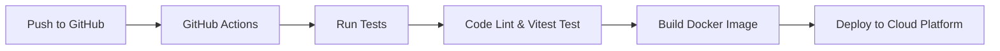

# Final Project - CI/CD Deployment

This repository contains the final project for the PSO (Pengantar Sistem Operasi) course. The focus of this project is to implement and demonstrate **CI/CD deployment** practices in a real-world scenario using modern development tools and environments.

## 🔧 Project Overview

In this project, our team built a simple web-based application and integrated a full CI/CD pipeline. This includes:

- **Continuous Integration & Deployment:** Fully automated using GitHub Actions.
- **Containerization:** The application is containerized using Docker for consistent and portable deployments.
- **Cloud Deployment:** Automatically deployed to Google Cloud Run after a successful merge to the `main` branch.
- **Automated Quality Checks:** Code quality is enforced through automated jobs for ESLint, Prettier (formatting), TypeScript (type checking), and Vitest (unit testing).
- **Version Control:** Managed with Git and hosted on GitHub.
- **Package Management:** Handled efficiently using `pnpm`

---

## 👥 Team Members

| Name          | Student ID |
| ------------- | ---------- |
| Hanin Nuha    | 5026221141 |
| Ratna Amalia  | 5026221209 |
| Muhammad Rafa | 5026221213 |
| Ishaq Yudha   | 5026221214 |

---

## 🚀 CI/CD Pipeline Flow

The core of this project is an automated pipeline configured using **GitHub Actions**. The entire process, from code submission to a running application in the cloud, is managed through workflows defined in the `.github/workflows/` directory.



---

## ⚙️ Setup & Contribution (Local Development)

Follow these steps to set up the local development environment for making changes or adding features.

### Prerequisites

- [Node.js](https://nodejs.org/) (v20.x or newer)
- [pnpm](https://pnpm.io/) (install globally with `npm install -g pnpm`)
- [Docker Desktop](https://www.docker.com/products/docker-desktop/) (required to test container builds locally)

### Installation Steps

1.  **Clone the Repository:**

    ```bash
    git clone https://github.com/amaliartnaa/todolist-devops.git
    cd todolist-devops
    ```

2.  **Install Dependencies:**

    ```bash
    pnpm install
    ```

3.  **Run the Development Server:**
    ```bash
    pnpm dev
    ```
    Open [http://localhost:3000](http://localhost:3000) in your browser to see the application running.

---

## 🐳 Docker Usage (Local Testing)

You can simulate the Docker build process used by the CI/CD pipeline on your local machine.

1.  **Build the Docker Image:**
    Make sure Docker Desktop is running. In your terminal, from the project's root directory, run:

    ```bash
    docker build -t todolist-devops:local .
    ```

2.  **Run the Docker Container:**
    After the image is successfully built, run a container from it:
    ```bash
    docker run -p 3000:3000 --name todo-app-local todolist-devops:local
    ```
    The application is now running at `http://localhost:3000` from within a container.
